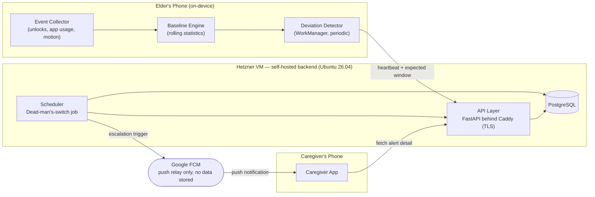
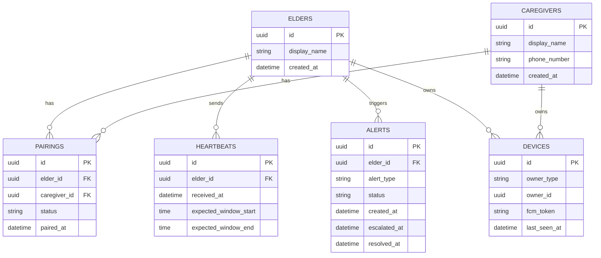
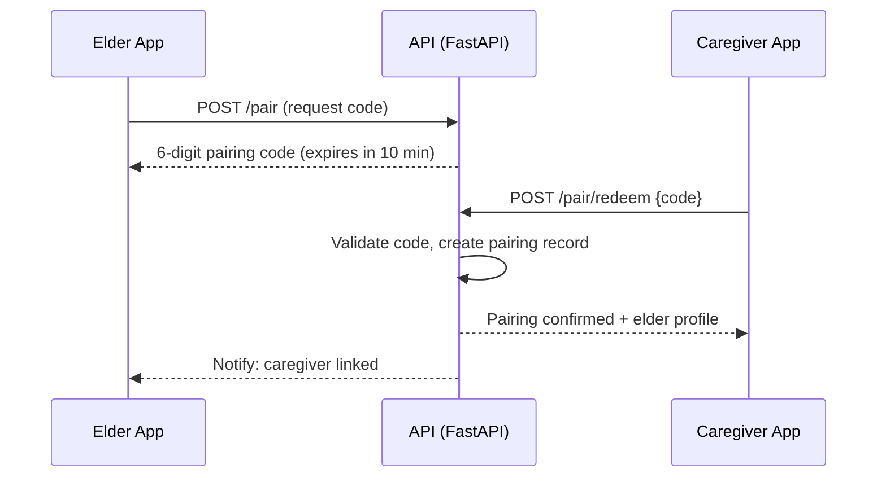
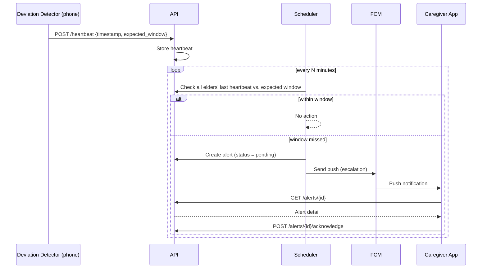
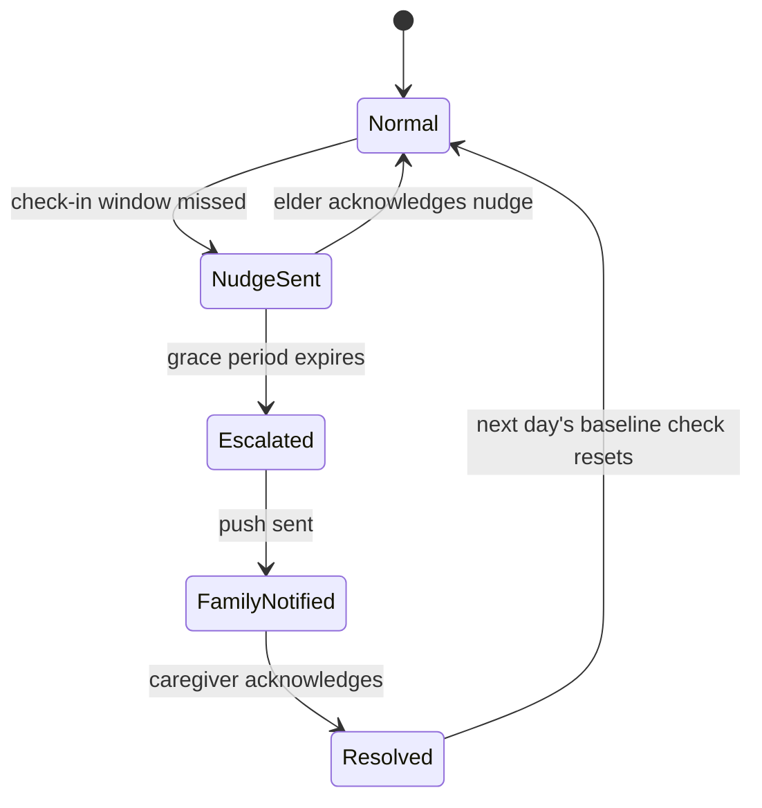
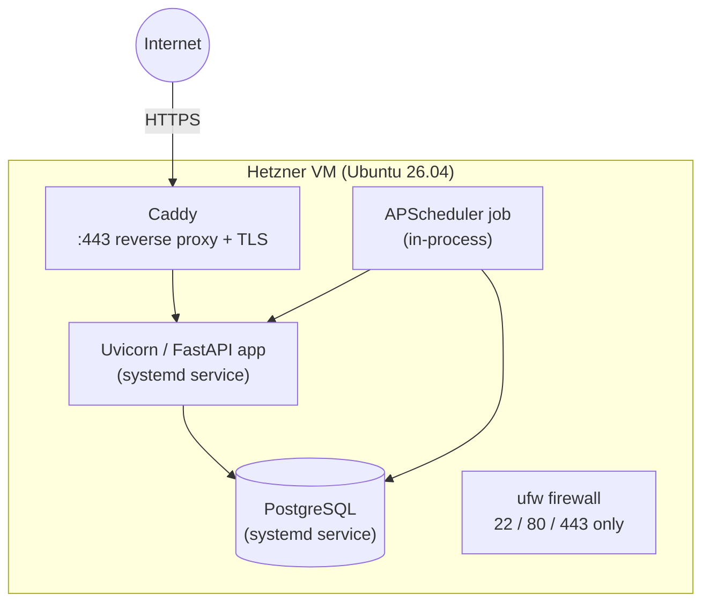

# KinSync — Architecture & Execution Plan (`plan.md`)

**Project:** KinSync — Passive Daily Pattern Monitor for Elderly Living Alone
**Version:** 0.1 (Phase-1 draft)
**Last updated:** 12 Sep 2026
**Companion document:** `spec.md` (requirements & acceptance criteria — read that first)

---

## 1. Guiding Principles

1. **Privacy by construction, not by policy.** Raw activity data (unlock times, app names, motion) never leaves the elder's device. Only derived, minimal signals (a heartbeat and an expected check-in window) are transmitted.
2. **Dead-man's switch, not self-reporting.** The backend — not the elder's phone — owns the decision of when to escalate, because the phone itself may be the thing that's failed (dead battery, no signal, an unresponsive user).
3. **Ask before alarming.** The elder always gets a chance to say "I'm fine" before family is notified.
4. **Own the stack to learn the stack.** The backend is deliberately self-hosted on a Hetzner VM rather than built on a managed BaaS, so the team gains real experience with API design, databases, scheduling, and Linux server administration.

## 2. System Architecture

**Why this shape:** the elder's phone does all the "understanding" of what's normal for that person (privacy-sensitive work stays local). The backend only ever sees a thin, derived summary, but is still able to independently decide "this elder has gone quiet" because it tracks *expected* windows, not raw behavior. FCM is used purely as Google's mechanism for waking a sleeping Android device — no alert content or user data is ever stored by Google.

## 3. Tech Stack

| Layer | Choice | Notes |
|---|---|---|
| Mobile app | **Kotlin**, Jetpack (Compose, WorkManager, Room) | Android-only by design (see `spec.md` NFR-5) |
| Backend language/framework | **Python 3 + FastAPI** | Async, auto-generated OpenAPI docs, Pydantic validation |
| Database | **PostgreSQL** | Relational fit for pairings/alerts/heartbeats; teaches transferable SQL skills |
| Background scheduling | **APScheduler** (in-process); Celery + Redis considered for a later phase if needed | Drives the dead-man's-switch check |
| Push notifications | **Firebase Cloud Messaging (HTTP v1 API)** | Used only as a push relay — no Firestore/Auth/Hosting |
| Reverse proxy / TLS | **Caddy** | Automatic HTTPS via Let's Encrypt |
| Deployment | **Bare-metal systemd services** on Ubuntu 26.04 (Docker considered as a later refinement) | Chosen deliberately so the team learns the underlying OS-level pieces first |
| Auth | Lightweight device-bound bearer tokens issued at registration | Simpler than full OAuth2 for this project's scope |
| Security hardening | `ufw`, SSH key-only login, `fail2ban`, unattended-upgrades | |
| Backups | Nightly `pg_dump` cron job | Protects months of real pilot data |
| Hosting | Hetzner VM (Ubuntu 26.04), CX22-class sizing | Sufficient for pilot-scale traffic |

## 4. Components & Modules

Each module is tagged with the phase it's first introduced in (see §7 for the phase roadmap). Tags will be updated as phases complete.

### 4.1 Android App

| Module | Responsibility | Phase |
|---|---|---|
| **Onboarding & Consent UI** | Role selection (Elder/Caregiver), plain-language consent screen, permission rationale | Phase 1 (basic) → refined Phase 4 |
| **Event Collector** | `BroadcastReceiver` for unlock/screen events, `UsageStatsManager` queries, Activity Recognition | Phase 1 (unlock events) → Phase 2 (usage + motion) |
| **Local Storage** | Room database for raw events, on-device only | Phase 1 |
| **Baseline Engine** | Rolling statistics over the local event log | Phase 2 |
| **Deviation Detector** | Periodic `WorkManager` job comparing today vs. baseline; in-app nudge | Phase 2–3 |
| **Heartbeat Sync Client** | Sends derived heartbeat + expected window to backend | Phase 2 |
| **Pairing UI** | Generate/redeem pairing codes | Phase 2 |
| **Caregiver Dashboard UI** | Status view, activity trend, acknowledge/resolve alerts | Phase 4 |

### 4.2 Backend (Hetzner VM)

| Module | Responsibility | Phase |
|---|---|---|
| **API Layer** | FastAPI routers behind Caddy; starts as a bare health-check | Phase 1 (health check) → grows each phase |
| **Data Layer** | SQLAlchemy models + Alembic migrations against PostgreSQL | Phase 1 (connectivity only) → Phase 2 (real schema) |
| **Auth** | Device-bound bearer token issuance/validation | Phase 2 |
| **Pairing Service** | Pairing-code generation/redemption logic | Phase 2 |
| **Scheduler (dead-man's switch)** | Periodic job checking every elder's heartbeat against their expected window | Phase 3 |
| **Notification Service** | FCM Admin SDK wrapper, sends escalation pushes | Phase 3 |
| **Ops/Deployment** | systemd units, Caddy config, firewall, backups | Phase 1 (minimal) → hardened through later phases |

## 5. Data Model

Note the deliberate omission of any raw-activity table on the backend — this is the schema-level enforcement of the privacy principle in §1.

## 6. API Contract (target shape, grows across phases)

| Method | Path | Purpose | Phase |
|---|---|---|---|
| GET | `/health` | Liveness check | 1 |
| GET | `/health/db` | Confirms DB connectivity | 1 |
| POST | `/pair` | Elder requests a pairing code | 2 |
| POST | `/pair/redeem` | Caregiver redeems a pairing code | 2 |
| POST | `/devices/register` | Register a device + FCM token | 2 |
| POST | `/heartbeat` | Elder app sends heartbeat + expected window | 2 |
| GET | `/alerts` | Caregiver lists alerts for their linked elder(s) | 3 |
| GET | `/alerts/{id}` | Alert detail | 3 |
| POST | `/alerts/{id}/acknowledge` | Caregiver resolves an alert | 3 |

## 7. Key Flows

### 7.1 Pairing

### 7.2 Heartbeat & Dead-Man's-Switch Escalation

### 7.3 Alert Lifecycle

### 7.4 Deployment / Server Internals

## 8. Execution Strategy — Review Timeline

| Review | Deadline | Target completion | Plan document phase |
|---|---|---|---|
| Review 1 | 21 Aug 2026 | Problem, objectives, scope, literature survey | ✅ Complete |
| **Review 2** | **25 Sep 2026** | **~20%** — requirement analysis, system design, component selection, initial prototype | **Phase-1 (detailed below)** |
| Review 3 | 16 Oct 2026 | ~30% | Phase 2 (to be detailed after Phase-1 completes) |
| Review 4 | 29 Jan 2027 | ~50%, major modules integrated | Phase 3 (to be detailed later) |
| Review 5 | 12 Mar 2027 | ~80%, all modules integrated, tested | Phase 4 (to be detailed later) |
| Review 6 / Open House | 2 Apr 2027 | 100%, full demo, innovation & impact framing | Phase 5 (to be detailed later) |
| Report submission | 2 Apr 2027 | Full academic report | — |

This document (`plan.md`) already contains the full requirement analysis, system design, tech stack, and component/module breakdown needed for Review 2. What remains for Review 2 is the initial prototype work described in Phase-1 below.

---

## Phase-1 (Target: Review 2 — by 25 Sep 2026)

### Objective

Prove technical feasibility of **both halves** of the system — on-device passive collection and the self-hosted backend — with a minimal, working, demonstrable slice. **No business logic yet** (no baseline, deviation detection, pairing, or escalation). The goal is to retire the two biggest technical risks early: *do the Android background-collection APIs behave as expected on a real device*, and *does the self-hosted deployment pipeline actually work end-to-end*.

### Deliverables

1. **Documentation** — this `spec.md` and `plan.md`, reviewed and signed off by the project guide. Satisfies the "requirement analysis," "system design," and "component selection" line items for Review 2.

2. **Backend infrastructure feasibility**
   - Hetzner VM provisioned (Ubuntu 26.04), hardened: `ufw` (22/80/443 only), SSH key-only login, `fail2ban`, unattended-upgrades enabled.
   - Domain/subdomain pointed at the VM; Caddy installed and automatically serving HTTPS.
   - PostgreSQL installed, a `kinsync` database created, connectivity verified.
   - A minimal FastAPI app deployed as a systemd service (`kinsync-api.service`) exposing:
     - `GET /health` → `{"status": "ok"}`
     - `GET /health/db` → runs `SELECT 1` against Postgres and reports success/failure
   - Reachable over the public domain via HTTPS.

3. **Android app skeleton feasibility**
   - New Kotlin project; minimum SDK level decided and documented in this file once chosen.
   - Onboarding screen requesting the `PACKAGE_USAGE_STATS` special permission (via Settings deep-link) and the battery-optimization allowlist prompt, with a plain-language rationale (an early version of the FR-7.1 consent screen).
   - A `BroadcastReceiver` capturing `ACTION_USER_PRESENT` / screen on-off events, writing timestamped rows into a local Room database.
   - A simple debug/list screen showing captured events live, proving the collection pipeline works end-to-end on a real device.

4. **Stretch goal (only if time allows)** — one manual network call from the Android app to the backend's `/health` endpoint on app launch, proving the two halves can already talk to each other ahead of real pairing/heartbeat logic in Phase 2.

### Explicitly Out of Scope for Phase-1

Baseline computation, deviation detection, escalation logic, pairing, FCM push, caregiver app/UI, SMS fallback, and Activity Recognition motion capture. These are deferred to Phase 2 onward so the team can prove the plumbing first without getting stuck on business logic before it's proven.

### Suggested Demo for the Review 2 Panel

1. Walk through the architecture and data-flow diagrams in this document — explain the privacy-by-construction and dead-man's-switch design rationale.
2. **Live demo (device):** unlock the test phone a few times in front of the panel; show the debug screen updating with new timestamped events in real time.
3. **Live demo (backend):** open the deployed HTTPS URL in a browser (or `curl`) and show the `/health` and `/health/db` responses.
4. Explicitly state which requirements from `spec.md` (FR/NFR IDs) this proves, and which remain for later phases — ties the demo directly back to the requirements document.

### Definition of Done for Phase-1

- [ ] `spec.md` and `plan.md` reviewed and signed off by the project guide
- [x] VM reachable at `https://<domain>/health` returning 200 OK
- [x] `/health/db` confirms live PostgreSQL connectivity
- [x] Android app installed on a real test device, both special permissions requested and granted
- [x] At least 24 hours of real unlock-event data visible in the on-device debug screen
- [ ] This document updated with any deviations from plan, ready to hand off into Phase-2 planning

### Future Phases (placeholder — to be detailed once Phase-1 is complete)

| Phase | Review | Target date | Rough scope |
|---|---|---|---|
| Phase 2 | Review 3 | 16 Oct 2026 | Pairing + auth, baseline engine, heartbeat sync client, `/pair` `/devices` `/heartbeat` endpoints, real DB schema live |
| Phase 3 | Review 4 | 29 Jan 2027 | Deviation detector, scheduler dead-man's-switch, FCM integration, first end-to-end escalation demo |
| Phase 4 | Review 5 | 12 Mar 2027 | Caregiver app/UI, consent & transparency screens finished, pilot users onboarded, testing & threshold tuning |
| Phase 5 | Review 6 + Report | 2 Apr 2027 | Polish, performance evaluation, documentation, Open House demo, final report |

Each of these will be expanded into full detail (deliverables, demo plan, definition of done) once Phase-1 is complete and reviewed, following the same format used above.
